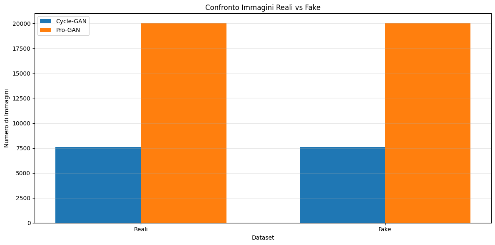

# DeepFake Detection attraverso l'utilizzo del modello CLIP

[](https://www.python.org/)
[](https://pytorch.org/)
[](https://github.com/openai/CLIP)

## 📝 Descrizione del Progetto
L'obiettivo della ricerca è lo sviluppo di un sistema di classificazione binaria per distinguere immagini reali da immagini sintetiche (Deepfake). Il cuore del sistema è il modello **CLIP (Contrastive Language-Image Pretraining)**, utilizzato come estrattore di feature visive e testuali.

## 🔬 Metodologia e Scelte Progettuali
Il sistema sfrutta un'architettura basata su **Triplet Loss** per mappare le immagini in uno spazio latente dove:
* **Anchor**: Immagini reali.
* **Positive**: Immagini simili alle reali.
* **Negative**: Immagini fake.

Il modello mira a minimizzare la distanza tra anchor e positive, massimizzando contemporaneamente quella tra anchor e negative.

### ⚙️ Configurazione
* **Modello Visione**: Transformer $Vit-B/32$ (per sola immagine) e $Vit-B/16$ (per approccio multimodale).
* **Pre-processing**: Ridimensionamento a $200\times200$ pixel, denormalizzazione e normalizzazione specifica CLIP.
* **Embedding**: Riduzione della dimensionalità da 512 a 128.
* **Classificatore**: Support Vector Machine (SVM) con suddivisione 70% Training, 10% Validation, 20% Test.

---

## Creazione dell'Ambiente Virtuale
Per un'esperienza utente migliore, si consiglia di creare un ambiente virtuale per il progetto e di attivarlo prima di procedere oltre. Sentiti libero di usare qualsiasi gestore di pacchetti Python per creare l'ambiente virtuale; tuttavia, il nostro team ha deciso di utilizzare [Conda](https://anaconda.org/). 
Utilizza il seguente comando per la creazione dell'enviroment:
```
conda create --name env_name
```
Successivamente, utilizza il seguente comando per attivare l'ambiente appena creato::
```
conda activate env_name
```

## Clonazione della repository
Puoi scaricare la repository tramite il comando da terminale eseguendo:
```
git clone https://github.com/chiarapuglia99/Deepfake.git
```

## 📊 Dataset
Il dataset è costituito da 2.496.738 immagini di cui 964.989 rappresentano le immagini reali mentre 1.531.749 rappresentano le immagini fake. Per la generazione delle immagini fake, sono stati utilizzati 25 generatori (come 13 GANs, 7 Diffusion, e 5 miscellaneous generators) e per quanto riguarda le categorie incluse nel dataset sono: Human/Human Faces, Animal/Animal Faces, Places, Vehicles, Art, e altri oggetti real-life. Il dataset, inoltre, è stato suddiviso in 32 cartelle, ognuna delle quali contiene un file metadata.csv all’interno
del quale sono state definite le seguenti informazioni: 
* **Filename:** Rappresenta il nome dell’immagine.
* **image_path:** Rappresenta il percorso fino alla cartella in cui è situata l’immagine.
* **target:** Rappresentato da un numero che va da 0 a 6 dove 0 indica le immagini reali mentre tutti gli altri valori maggiori di 0 rappresentano le immagini fake.
* **category:** Rappresentata da una stringa, è associata all’immagine di riferimento e ne rappresenta il tipo.

Per l'addestramento sono stati utilizzati subset bilanciati:

* **Cycle-GAN**: 7.605 reali / 7.605 fake.
* **Pro-GAN**: 20.000 reali / 20.000 fake.



---

## 📈 Risultati
L'efficacia è stata testata su tre diverse configurazioni.

### 1. Estrazione Sola Immagine
| Dataset | Accuracy (Test) | Precision | Recall | F1-Score |
| :--- | :--- | :--- | :--- | :--- |
| **Cycle-GAN** | 94.0%  | 94.0% | 94.0% | 94.0% |
| **Pro-GAN** | 91.85% | 91.85% | 91.85% | 91.85% |

### 2. Immagine + Testo (Somma degli Embedding)
Risultati ottenuti fondendo le feature visive con la categoria testuale.
* **Dataset Combinato Accuracy**: 91.25%.

### 3. Immagine + Testo (Prodotto degli Embedding)
Risultati ottenuti tramite prodotto elemento per elemento per cogliere l'interazione diretta.
* **Dataset Combinato Accuracy**: 90.57%.

---

## 🚀 Conclusioni
Entrambi gli approcci utilizzati (estrazione delle sole immagini ed estrazione delle immagini+testo) per fare distinzione tra immagini reali e immagini fake hanno portato al raggiungimento di buoni risultati, in quanto entrambi gli approcci effettuano una buona generalizzazione dei dati. Tuttavia, sulla base dei risultati ottenuti, è possibile effettuare ulteriore ricerca al fine di migliorare i risultati raggiunti, per farsì che il modello sia in grado di effettuare una separazione netta tra immagini reali ed immagini fake.

## 👥 Autori
* [**Chiara Puglia**](https://github.com/chiarapuglia99): Master's Degree Student in Computer Science, curriculum Data Science and Machine Learning at University of Salerno.
* [**Luca Giuliano**](https://github.com/Kizorat): Master's Degree Student in Computer Science, curriculum Data Science and Machine Learning at University of Salerno.

---

## 📚 Riferimenti
* [1] [Dataset DeepFake](https://github.com/awsaf49/artifact).
* [2] Exploring the Adversarial Robustness of CLIP for AI-generated Image Detection 2024 IEEE International Workshop on Information Forensics and Security (WIFS) | Autori: Vincenzo De Rosa, Fabrizio Guillaro, Giovanni Poggi, Davide Cozzolino and Luisa Verdoliva -University Federico II of Naples, Italy.
* [3] Synthetic Image Verification in the Era of Generative Artificial Intelligence What Works and What Isnt There yet.
* [4] [Clip Deepfake Detection](https://github.com/chuangchuangtan/C2P-CLIP-DeepfakeDetection/tree/main)
* [5] [CLIP Model and the Importance of Multimodal Embeddings](https://medium.com/data-science/clip-model-and-the-importance-of-multimodal-embeddings-1c8f6b13bf72)
* [6] [Image-Classification-CLIP](https://www.pinecone.io/learn/series/image-search/zero-shot-image-classification-clip/)
* [7] [Guida per l'implementazione di Early Stopping in Pytorch](https://medium.com/biased-algorithms/a-practical-guide-to-implementing-early-stopping-in-pytorch-for-model-training-99a7cbd46e9d)
